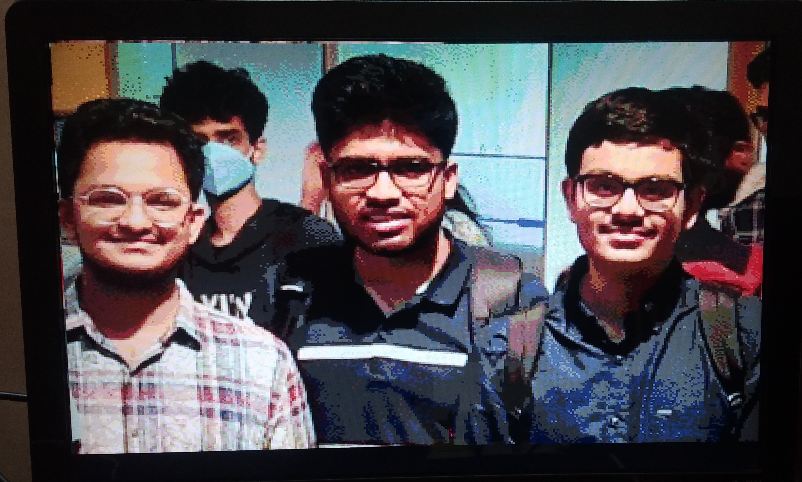

# OV7670 based video camera to a VGA display
-------------

## Students
1. [Sai Manish Sasanapuri](https://github.com/Sai-Manish/)
2. [Shubhayu Das](https://github.com/Shubhayu-Das/)
3. [Veerendra S. Devaraddi](https://github.com/vsdevaraddi)


<div align="center"> (from left to right) Manish, Veerendra, and Shubhayu</div>

------------------

## Course
VL504 - System Design with FPGAs - course project @ [IIITB](https://www.iiitb.ac.in/), under [Professor Nanditha Rao](https://www.iiitb.ac.in/faculty/nanditha-rao)

-----------------

## Project
Displaying video on a VGA monitor using an OV7670 camera

**For more details on the project, see the project report in this repo.** Additional references are mentioned at the bottom of the report.

-----------------

## Hardware requirements:

1. A Basys 3 development board. An equivalent is fine, but the pinouts will change.
2. An OV7670 module(*without* the FIFO chip)
3. A VGA monitor and VGA cable.
4. USB wire for programming the dev-board(comes with it).

--------------------------------

## Instructions for running

### Video over VGA using the OV7670

1. Create a new Vivado project
2. Add the following **source** files:
    * Add *all* the files in the ```src/ov7670_with_vga/``` folder (including the ```src/ov7670_with_vga/ov7670/``` folder).
    * Add all the files inside the ```src/vga/``` folder.

3. Add ```constraints/ov7670_constraints.xdc``` file as a constraint.
4. Generate the bitstream.
5. While Vivado is generating the bitstream, make the following connections:
    * Connect a VGA monitor to the Basys 3 board
    * Wire the OV7670 camera module as per the mapping given in: ```ov7670_basys3_wiring.txt```

6. Upload and run the program.

-----------

### Video over UART

1. Create a new Vivado Project
2. Add the following files as **sources** to the project:
    * All the files in the ```src/vga/``` folder.
    * The file in the ```src/uart/``` folder.
    * The ```src/vga_over_uart_controller.v``` file.
3. Add ```constraints/vga_over_uart_constraints.xdc``` as a constraint.
4. Install the following packages in Python:
    * Numpy
    * Matplotlib
    * imageio[ffmpeg]       <-- this is the exact name
    * Pyserial

5. Generate the bitstream for the project in Vivado
6. Meanwhile, connect the VGA monitor to the Basys 3 board, plug in the programming cable and power on the Basys 3 board.
7. Find which COM port is being used by Basys 3. This will vary depending on your OS.
8. Open ```scripts/vga_over_uart.py```. Edit **line 10** to the COM port used by Basys 3.
9. If you are on Linux/MacOS, you need to give write access to the comport. This can be done using ```sudo chmod a+rw <COMPORT>```
10. Run the ```video_over_uart.py``` program, and see the results on the VGA monitor. There are a variety of options in the script, which are well documented there. Feel free to play with them.

----------------

## Folder structure

```bash
.
├── constraints
│   ├── ov7670_constraints.xdc          
│   └── vga_over_uart_constraints.xdc
├── images                  # All the images used for the report/project. The files name are self-explanatory
│   ├── report-images
│   ├── sccb-simulation
│   ├── us.jpg
│   ├── vga_from_ov7670
│   ├── vga-over-uart
│   └── vga-simulation
├── ov7670_basys3_wiring.txt        # Wiring diagram for the OV7670 module
├── scripts
│   ├── create_coe.py       # Script to generate a coefficient file
│   ├── data.py             
│   ├── downscale.m         # MATLAB script to generate a data file from an image file
│   ├── mapping.py
│   └── video_over_uart.py  # Sending video data over UART
├── simulation
│   ├── sccb
│   │   └── sccb_configuration_tb.v
│   └── vga
│       └── vga-tb.v
└── src
    ├── our-sccb
    │   └── sccb_configuration.v
    ├── ov7670_with_vga
    │   ├── ov7670
    │   │   ├── camera_configuration.v
    │   │   ├── camera_read.v
    │   │   ├── OV7670_configuration_rom.v
    │   │   ├── OV7670_configuration.v
    │   │   ├── SCCB_configuration.v
    │   │   └── top_camera.v
    │   └── top_controller.v
    ├── uart
    │   └── uart_rx.v
    ├── vga
    │   ├── h_sync.v
    │   ├── vga.v
    │   └── v_sync.v
    └── vga_over_uart_controller.v
```

---------------

For implementation based queries, feel free to raise an issue.